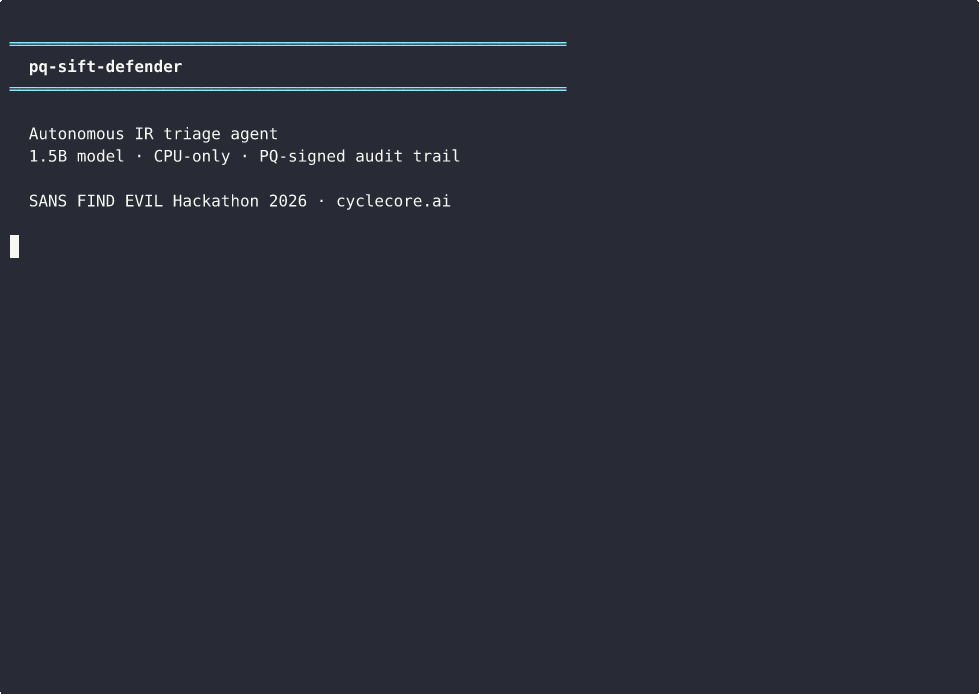
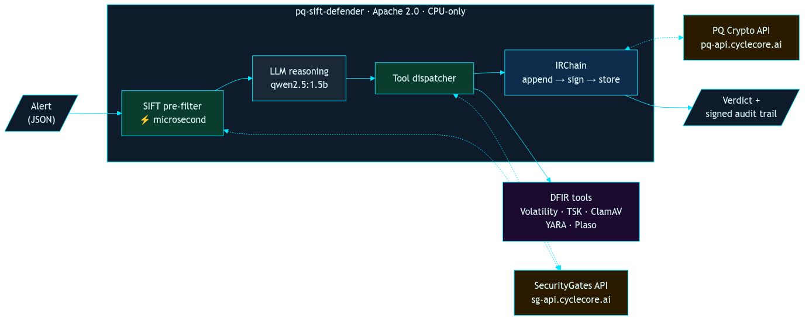

# pq-sift-defender

**Autonomous incident-response triage with defense-in-depth against prompt
injection and a post-quantum-signed audit trail.**

Apache 2.0. Fine-tuned 1.5B model, CPU-only, under 10 seconds per triage. No GPU required.

[](demo/submission-video.mp4)
[](LICENSE)
[](https://huggingface.co/CycleCoreTechnologies/pq-sift-defender-Q4_K_M)



<sup>Two contrasting investigations at 1× speed, followed by independent audit-chain
verification against the public attestation API.
Full narrated walkthrough: <a href="demo/submission-video.mp4"><code>demo/submission-video.mp4</code></a></sup>

---

## What it does

pq-sift-defender reads a security alert — EDR record, WAF log, IDS event, phishing
report — and runs an autonomous DFIR investigation. The agent reasons about the alert
with a local LLM (Ollama-served `qwen2.5:1.5b`, CPU-only) and decides which forensic
tools to call: Volatility 3, The Sleuth Kit, ClamAV, YARA, Plaso, and a string
classifier for OWASP-class injection patterns. It returns a verdict (**PASS** /
**FLAG** / **BLOCK**) with a PQ-signed, append-only audit chain of every action it took.

## Why this matters

Autonomous agents are powerful investigative tools, but they introduce a new class of
vulnerability: the agent itself becomes an attack surface. A crafted alert payload can
inject instructions that cause the agent to exfiltrate data, reach internal endpoints,
or suppress its own findings.

pq-sift-defender addresses both sides of this problem through two security boundaries
that are absent from conventional agentic IR tools.

### Agent-to-tool security boundary

Every string the agent generates as tool input is classified at microsecond latency by
a security-gates API before it reaches a downstream tool. If the agent is manipulated
into emitting an SSRF URL, a SQL injection payload, or a path-traversal string, the
boundary blocks the dispatch and records the interception as a signed entry on the
audit chain.

Concrete proof: [`samples/prompt_injection_alert.json`](samples/prompt_injection_alert.json)
plants a directive telling the agent to fetch `169.254.169.254` cloud metadata. The
1.5B model takes the bait. The security boundary catches it. The model was compromised;
the system was not.

A frontier model can self-correct, but it can also be talked out of self-correcting.
The boundary operates below the reasoning layer -- the model cannot reason around it.
A fine-tuned 1.5B specialist paired with an architectural guardrail catches 100%
of attacks in held-out evaluation, with the right tradeoff for a security tool: slight
conservative bias, zero missed threats.

### Post-quantum audit trail

Every dispatched tool call and every verdict is appended to an audit chain backed by a
public post-quantum signing API using ML-DSA-65 (NIST FIPS 204). The chain is exportable
as JSON and verifiable offline against the public key. ML-DSA-65 signatures resist quantum
cryptanalysis, so the audit trail remains verifiable and admissible decades from now. Any
third party can repeat the verification with just the chain ID.

## Architecture



See [`docs/architecture.md`](docs/architecture.md) for component details and
security boundaries.

## Deploy where the incident is

The agent runs on the affected server itself, including older hardware without a GPU.
Triage happens where the incident is occurring, not after evidence ships to a SOC. The
LLM, the DFIR tools, and the agent loop are all local.

| Resource | Requirement |
|---|---|
| RAM | 2-3 GB free |
| CPU | One modern x86_64 core |
| Time | under 10 s per triage (fine-tuned model, CPU-only) |
| Disk | 5-10 GB |
| GPU | Not required |
| Python | 3.10+ |

## Evaluation

Validated on 136 held-out samples spanning benign system events, SSRF, SQL injection,
command injection, path traversal, prompt injection, CVE-grounded attacks, boundary
recovery, and malware memory dumps.

```
96.3% accuracy · 100% BLOCK · 94.6% PASS · under 10 s per triage · CPU-only · Apache 2.0
```

| Verdict | Accuracy | Notes |
|---|---|---|
| BLOCK | 100% (72/72) | Zero missed attacks |
| FLAG | 75% (6/8) | Small sample; tool-call format leakage on 2 edge cases |
| PASS | 94.6% (53/56) | 3 failures on adversarial quality-C edge cases |

Model: QLoRA fine-tuned Qwen2.5-1.5B-Instruct, Q4_K_M quantization.
[Pre-built GGUF on HuggingFace](https://huggingface.co/CycleCoreTechnologies/pq-sift-defender-Q4_K_M).

Tested on two CPUs with the fine-tuned model:

| CPU | Triage time | GPU required |
|---|---|---|
| Intel Core i9-14900KF | 5-8 s | No |
| AMD Ryzen 7 7800X3D | 5-8 s | No |

The base `qwen2.5:1.5b` is faster (~4 s) but less consistent on boundary
recovery and format adherence. We ship the fine-tuned model for accuracy.

Full results: [`docs/accuracy.md`](docs/accuracy.md). A static proof artifact at
[`samples/audit_chain_export.json`](samples/audit_chain_export.json) shows a real
signed audit chain from a real investigation — `verify.valid=True`, three entries,
each with a 3,309-byte ML-DSA-65 signature, hash-linked.

## Model

The agent uses a QLoRA fine-tuned Qwen2.5-1.5B-Instruct, served locally via Ollama
at Q4_K_M quantization (986 MB on disk). Pre-built GGUF available on
[HuggingFace](https://huggingface.co/CycleCoreTechnologies/pq-sift-defender-Q4_K_M). The base model was chosen because 1.5B is
the floor for reliable structured tool-calling on CPU — smaller models can't produce
consistent function calls, and newer "thinking" models (qwen3, qwen3.5) multiply
latency 5-17x by generating internal reasoning tokens the task doesn't need.

Fine-tuning was performed with a config-driven training pipeline on 785 unique
ShareGPT-format training samples across 7 source batches:

| Batch | Count | Description |
|---|---|---|
| Benign PASS | 150 | Clean system events that should not trigger alerts |
| Attack BLOCK | 210 | SQL injection, command injection, SSRF, path traversal |
| Boundary recovery | 163 | Prompt injection → agent-tool boundary interception |
| FLAG + format | 150 | Suspicious patterns requiring investigation |
| CVE-grounded | 62 | Real-world CVEs from CISA KEV catalog (Log4Shell, ProxyShell, etc.) |
| Hard PASS | 50 | Adversarial benign — looks suspicious but is legitimate |

The pipeline supports per-batch oversampling weights, per-sample quality-based loss
scaling (A/B/C tiers), hash-based deduplication, and system prompt injection at
prepare time. Three training profiles (fast/standard/thorough) are provided.

To reproduce or extend: see [`training/`](training/).

## Try it out

See [`docs/try-it-out.md`](docs/try-it-out.md) for the full setup guide.

```bash
git clone https://github.com/CycleCoreTech/pq-sift-defender
cd pq-sift-defender
pip install -e ".[dev]"
cp .env.example .env

# Get a free PQ API key (1k ops/day, one curl):
curl -sX POST https://pq-api.cyclecore.ai/v1/auth/register \
  -H "Content-Type: application/json" -d '{"email": "you@example.com"}'
# Paste the returned api_key into .env as CYCLECORE_PQ_API_KEY
# (or skip this and run fully offline with: PQ_AUDIT_BACKEND=stub)

ollama pull qwen2.5:1.5b              # base model (works out of the box)
pq-sift-defender investigate samples/path_traversal.json

# Optional: use the fine-tuned model for higher accuracy (96.3% vs ~80%)
# Download the GGUF from HuggingFace:
# https://huggingface.co/CycleCoreTechnologies/pq-sift-defender-Q4_K_M
# wget https://huggingface.co/CycleCoreTechnologies/pq-sift-defender-Q4_K_M/resolve/main/pq-sift-defender-Q4_K_M.gguf
# wget https://huggingface.co/CycleCoreTechnologies/pq-sift-defender-Q4_K_M/resolve/main/Modelfile
# ollama create pq-sift-defender -f Modelfile
# PQ_SIFT_MODEL=pq-sift-defender pq-sift-defender investigate samples/path_traversal.json
```

## Fully offline / air-gapped mode

The entire agent runs with zero network calls — no cloud APIs, no telemetry, no data
leaving the host:

```bash
PQ_AUDIT_BACKEND=stub pq-sift-defender investigate samples/path_traversal.json
```

The LLM and all DFIR tools already run locally. Setting `PQ_AUDIT_BACKEND=stub` switches
the audit chain to an in-memory hash-linked chain. For on-premises post-quantum signing
without the public cloud, deploy a PQ Box appliance or self-hosted instance behind your
firewall. See [`docs/try-it-out.md`](docs/try-it-out.md#advanced-airgapped-or-on-prem-deployment).

## Backend services

The agent integrates two public CycleCore APIs. Both have demo tiers that require no API
key, and free tiers (1,000 operations per day) that do.

| API | Endpoint | Purpose |
|---|---|---|
| SecurityGates | [`sg-api.cyclecore.ai/docs`](https://sg-api.cyclecore.ai/docs) | OWASP-class injection, traversal, and SSRF detection at microsecond latency |
| PQ Crypto | [`pq-api.cyclecore.ai/openapi.json`](https://pq-api.cyclecore.ai/openapi.json) | ML-DSA-65 signing and chain attestation |

Both APIs are separately replaceable. Point `CYCLECORE_SG_BASE_URL` or
`CYCLECORE_PQ_BASE_URL` at any server implementing the same OpenAPI spec.

## DFIR toolchain

Standard SANS SIFT Workstation 2026.04 toolchain. Compatible with any Linux that has
these tools available.

```bash
sudo apt install -y sleuthkit clamav
pip install --user volatility3 plaso yara-python
```

| Tool | Backing CLI / library |
|---|---|
| `vol_pslist`, `vol_netscan` | `vol` (PyPI `volatility3`) |
| `tsk_mmls`, `tsk_fls` | `mmls`, `fls` (apt `sleuthkit`) |
| `clamav_scan` | `clamscan` (apt `clamav`) |
| `yara_match` | `yara-python` |
| `plaso_timeline` | `log2timeline`, `psort` (PyPI `plaso`) |
| `sift_classify` | CycleCore SecurityGates API |

## Submission

Built for the [SANS FIND EVIL](https://findevil.devpost.com/) hackathon by
[CycleCore Technologies](https://cyclecore.ai).

## License

Apache 2.0 — see [`LICENSE`](LICENSE). Patent-grant scope is clarified in
[`NOTICE`](NOTICE).
