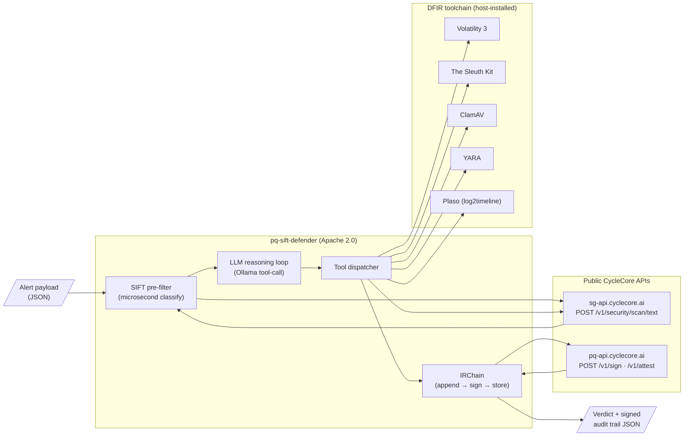

# Architecture

## Components

### Agent layer

| Component | File | Responsibility |
|---|---|---|
| **SIFT pre-filter** | `src/pq_sift_defender/sift/prefilter.py` | Scan alert payload + agent tool inputs against four OWASP gates (SQLi, command-injection, path traversal, SSRF) at microsecond latency. Block on `BLOCK`; allow `PASS` and `FLAG`. |
| **LLM reasoning loop** | `src/pq_sift_defender/agent/core.py` | Ollama-backed tool-use loop. Agent decides which DFIR tools to call against the alert's evidence. Default model `qwen2.5:1.5b` running CPU-only. |
| **Tool dispatcher** | `src/pq_sift_defender/agent/core.py` | Maps each tool call from the LLM to the appropriate backend (CycleCore API or host-installed DFIR tool). Returns structured JSON to the model. |
| **IRChain** | `src/pq_sift_defender/audit/chain.py` | Append-only audit chain. Every dispatched tool call is recorded as a signed entry. |

### Public CycleCore APIs (called as backend services)

| API | Endpoint | Purpose | Reference |
|---|---|---|---|
| **SecurityGates** | `https://sg-api.cyclecore.ai/v1/security/scan/text` | OWASP-class injection / traversal / SSRF detection | https://sg-api.cyclecore.ai/docs |
| **PQ Crypto** | `https://pq-api.cyclecore.ai/v1/sign`, `/v1/attest` | Post-quantum signing (ML-DSA-65) and attestation chains | https://pq-api.cyclecore.ai/openapi.json |

Both APIs are publicly callable. Demo tier requires no API key.

### DFIR toolchain (host-installed)

| Tool | Wrapper | Backing CLI / library |
|---|---|---|
| Volatility 3 | `src/pq_sift_defender/sift_tools/volatility_wrapper.py` | `vol` (PyPI `volatility3`) |
| The Sleuth Kit | `src/pq_sift_defender/sift_tools/sleuthkit_wrapper.py` | `mmls`, `fls`, `istat` (apt `sleuthkit`) |
| ClamAV | `src/pq_sift_defender/sift_tools/clamav_wrapper.py` | `clamscan` (apt `clamav`) |
| YARA | `src/pq_sift_defender/sift_tools/yara_wrapper.py` | `yara-python` (PyPI) |
| Plaso | `src/pq_sift_defender/sift_tools/plaso_wrapper.py` | `log2timeline`, `psort` (PyPI `plaso`) |

Tested against the SANS SIFT Workstation 2026.04 toolchain. Works on any
Linux with these tools available.

## Data flow

1. **Ingest**: Alert payload (JSON) is read from disk or passed to the CLI.
2. **Pre-filter**: All string content recursively extracted from the alert is
   classified against the four OWASP gates. If `BLOCK` is recommended, the
   alert is flagged at ingress and the agent receives the pre-filter signal.
3. **Reason**: The LLM receives the alert plus the pre-filter recommendation
   and decides which DFIR tools to call. Each tool call goes through the
   dispatcher.
4. **Tool dispatch**: The dispatcher routes each call to the appropriate
   backend (DFIR tool subprocess or public CycleCore API) and returns
   structured JSON to the model.
5. **Audit append**: Every dispatched tool call is appended to the IRChain.
   Each entry is signed via the public PQ Crypto API (Dilithium3 / ML-DSA-65)
   and chained by SHA-256 hash.
6. **Verdict**: When the model is confident, it returns a final natural-
   language verdict. The verdict itself is appended to the chain. The full
   chain JSON is exportable for offline audit.

## Security boundaries

| Boundary | Protection |
|---|---|
| Alert ingestion → agent reasoning | SIFT pre-filter blocks injection patterns from reaching the LLM |
| Agent tool inputs → downstream tools | SIFT pre-filter scans agent-generated tool inputs (defends against the LLM being manipulated into emitting attack payloads) |
| Tool execution → audit log | Every action signed before the next tool dispatch |
| Audit chain integrity | Server-authoritative chain (`/v1/attest`) signs and links each entry; public-key verification works offline against the chain export |
| Network egress | Only `sg-api.cyclecore.ai` and `pq-api.cyclecore.ai` (both public, well-known); no other outbound calls from the agent |

## Threat model alignment

- **Prompt injection via alert payload** → caught by SIFT pre-filter at ingress
- **Prompt injection via tool output** → SIFT pre-filter on agent-generated tool inputs (defense in depth)
- **Tool tampering / forensic disputation** → PQ-signed audit chain; signatures verifiable by anyone with the public key
- **Long-horizon evidence integrity** (multi-decade) → ML-DSA-65 signatures resist quantum cryptanalysis (NIST FIPS 204)
- **Network exfiltration via agent** → bounded egress to two public domains; auditable in chain
